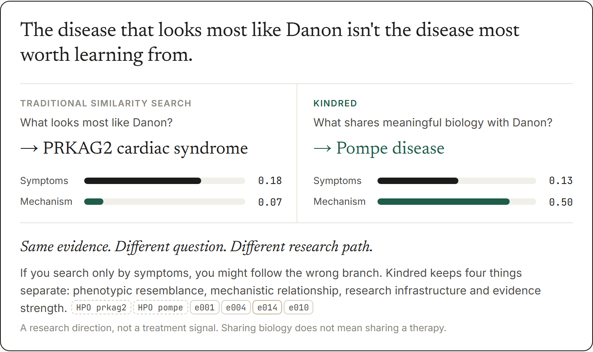
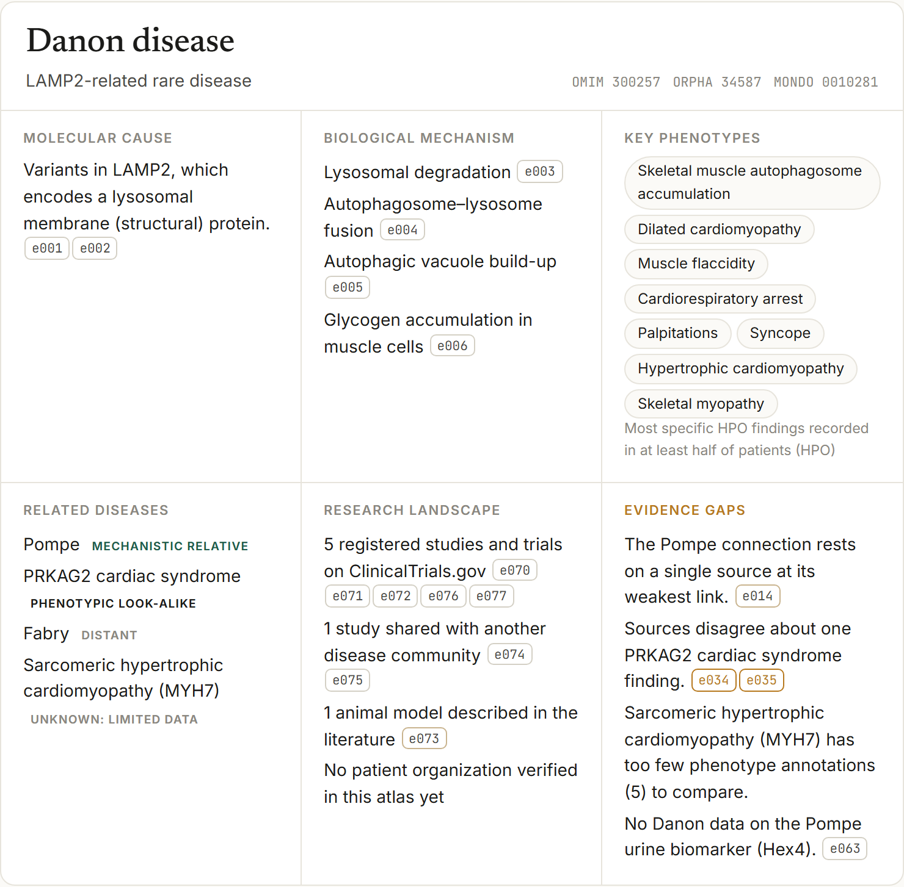
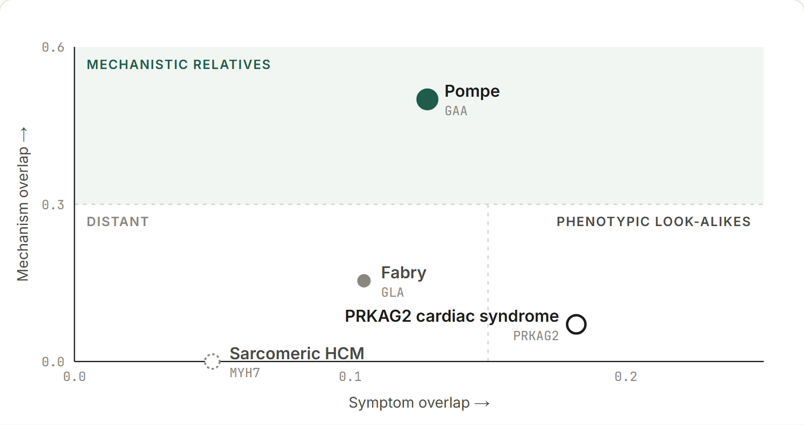
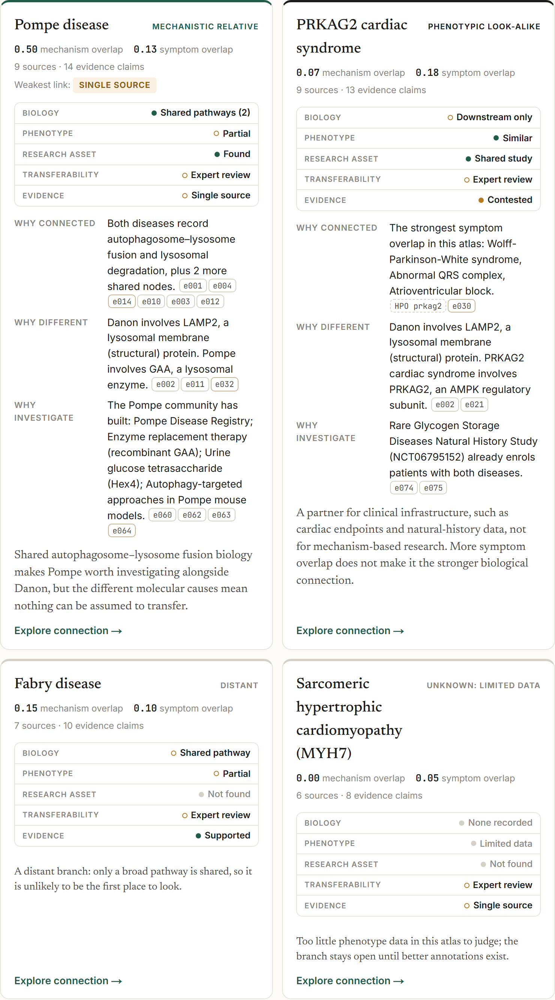
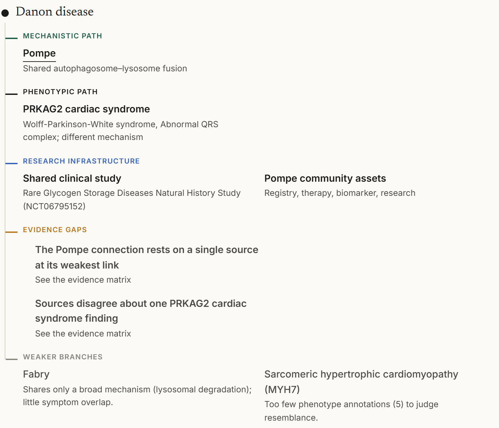
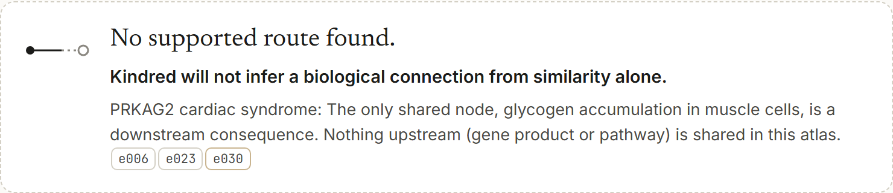
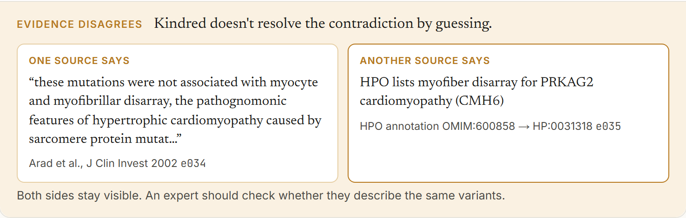
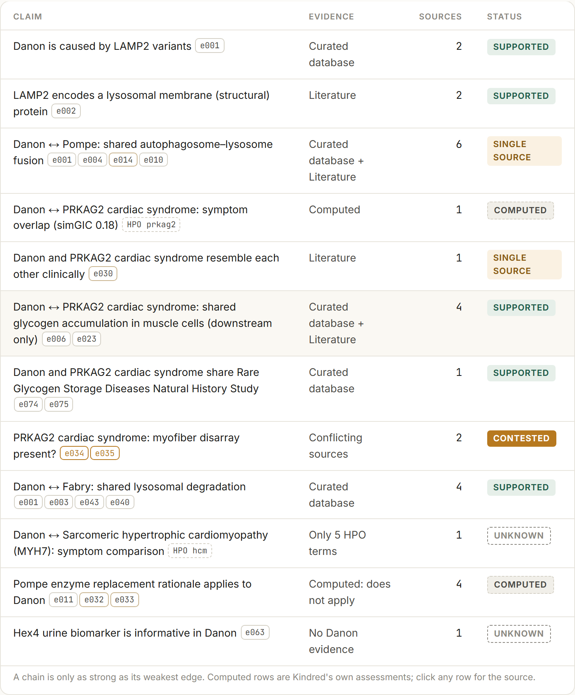
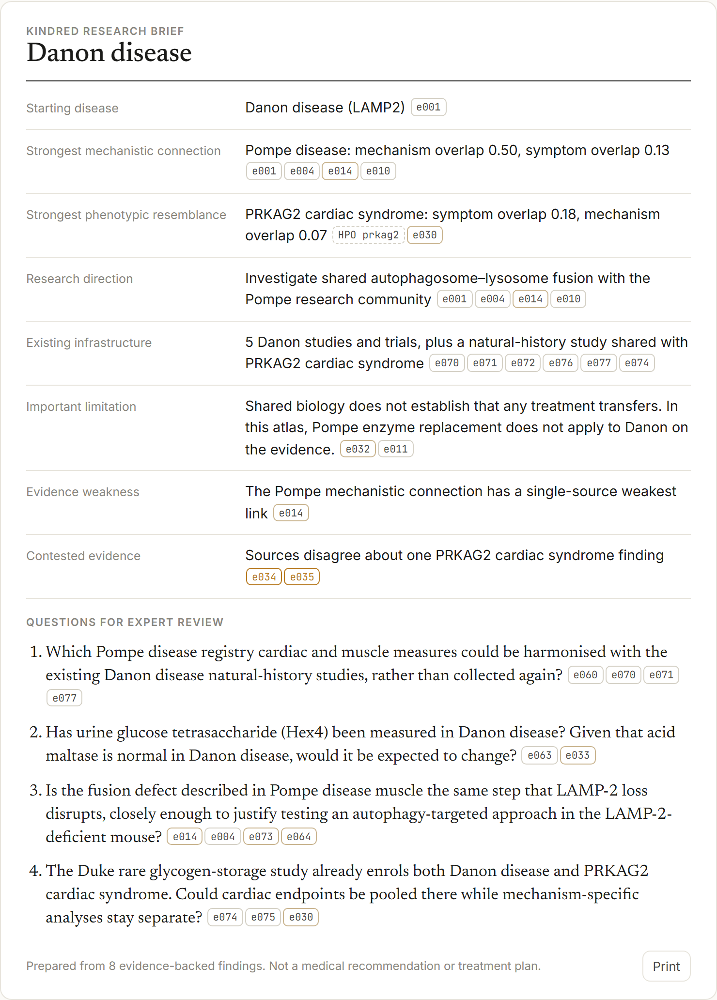
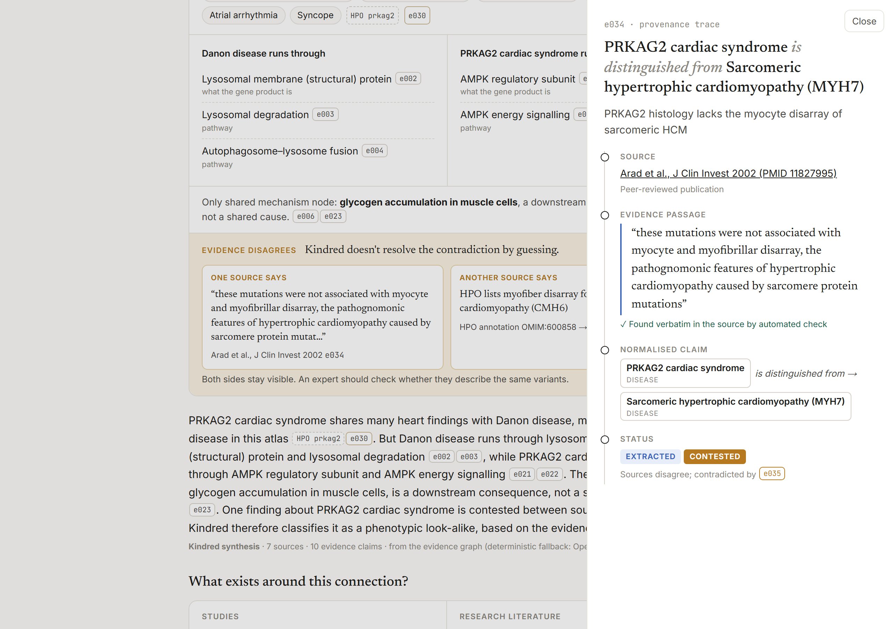

# Kindred

**Find the connection. Check the difference.**

Kindred is an evidence-first atlas that helps rare-disease patient communities and researchers find diseases that share their
biology, separate them from diseases that only look similar, and turn that difference into a concrete research step.

**53 machine-verified evidence quotes · deterministic graph reasoning · grounded OpenAI synthesis**

Built for the OpenAI × Buffalo Initiative × Hack-Nation challenge *AI Atlas for the World's Rare Diseases*.



---

## The problem

A rare disease can become an information island. A patient group leading research on an untreated disease needs to know who
shares their biology, what research already exists, and what to do next. That knowledge is scattered across papers, phenotype
databases, trial registries and patient organizations, and it is organised by disease name. Names hide mechanisms: different
genes can disrupt the same process, and similar symptoms can have different causes.

## The insight

**The disease that looks most like yours isn't necessarily the disease most worth learning from.**

In Kindred's atlas, computed from real data:

| Compared with Danon disease | Symptom overlap (HPO, simGIC) | Mechanism overlap |
|---|---|---|
| PRKAG2 cardiac syndrome | **0.18**, the highest in the atlas | 0.07 (only a downstream consequence shared) |
| Pompe disease | 0.13 | **0.50** (shared autophagosome–lysosome fusion, lysosomal degradation, autophagic build-up) |

A symptom-first search points to PRKAG2. A mechanism-first search points to Pompe. Same evidence, different question, different
research path. Kindred keeps four things separate: **phenotypic resemblance, mechanistic relationship, research infrastructure and
evidence strength.**

## Why traditional similarity isn't enough

| | Traditional similarity search | Kindred |
|---|---|---|
| Question | What looks most like Danon? | What shares meaningful biology with Danon, and how well do we know it? |
| Answer | PRKAG2 | Pompe as a *mechanistic relative*; PRKAG2 as a *phenotypic look-alike* that still shares clinical study infrastructure |
| Evidence | A score | Every edge sourced and quote-verified, with a status; the weakest link of each path is named |
| When unsure | Returns the nearest neighbour anyway | **No supported route found.** Kindred will not infer a biological connection from similarity alone |
| When sources disagree | Picks one | **Evidence disagrees.** Both sides shown, not resolved by guessing |

None of this implies that a Pompe therapy works for Danon. Kindred's compatibility check says Pompe enzyme replacement
**does not transfer**: Danon is caused by loss of a structural lysosomal protein, not an enzyme.

## Screenshots

| | |
|---|---|
|  Disease dossier |  Mechanism vs symptom map |
|  *Why connected / different / investigate*, with a status scorecard |  Kindred Path |
|  Knowing when not to connect |  A real contradiction, shown and not resolved |
|  How well each claim is known |  A brief to take into a research meeting |



## Architecture

```
Sources                PubMed abstracts · ClinicalTrials.gov API v2 · MedlinePlus Genetics · HPO annotations
   ↓
Entity normalisation   diseases with OMIM / Orphanet / MONDO IDs and aliases · genes · mechanism nodes in 3 tiers
   ↓
Evidence graph         data/graph.json: every edge has source, URL, verbatim passage, provenance, status
   ↓
Deterministic engine   lib/graph.ts · lib/research.ts · lib/compat.ts
                       · symptom overlap: simGIC over ancestor-propagated HPO terms, IC-weighted over 12,867 diseases
                       · mechanism overlap: weighted Jaccard over disease → gene → mechanism (weights 3 / 2 / 1)
                       · kinship: relative / look-alike / distant / unknown · weakest-link paths · compatibility rules
   ↓
Evidence integrity     verbatim quote checks · weakest-link rule · contradictions surfaced · no route from similarity alone
   ↓
OpenAI                 lib/llm.ts · intent + entity reconciliation (JSON schema, enum of atlas IDs)
                       · synthesis from ONLY the supplied edges, citing their IDs · guarded, with deterministic fallback
   ↓
Interface              Next.js · conversation as the interface · dossier, Kindred Path, connection cards,
                       evidence drawer, evidence matrix, research brief · /how (pipeline) · /story (inspiration)
```

No database, no vector store, no agents. The atlas is small on purpose: five diseases around Danon disease and 45 evidence edges,
rather than a large graph filled with synthetic relationships. Every displayed relationship has provenance.

## Evidence model

```json
{ "id": "e014", "subject": "GAA", "relation": "deficiency impairs", "object": "m_ap_fusion",
  "source": "Lim, Li & Raben, Front Aging Neurosci 2014 (PMID 25183957)",
  "sourceUrl": "https://pubmed.ncbi.nlm.nih.gov/25183957/",
  "evidence": "The autophagic process in Pompe skeletal muscle is affected at the termination stage-impaired autophagosomal-lysosomal fusion.",
  "provenance": "EXTRACTED", "status": "SINGLE_SOURCE" }
```

- **Provenance:** `CURATED` (reference resource), `EXTRACTED` (peer-reviewed publication), `INFERRED` (computed by Kindred, always labelled as an assessment).
- **Status:** `SUPPORTED` (curated resource or two independent sources), `SINGLE_SOURCE`, `CONTESTED` (paired with what contradicts it).
- **Weakest link:** a path is only as strong as its weakest edge. The Danon–Pompe connection is shown as single source because of e014.
- **No opaque scores.** Connection cards use a categorical scorecard: Biology, Phenotype, Research asset, Transferability, Evidence.

## OpenAI's role

The graph decides what is supported. OpenAI helps explain it.

1. **Interact:** turns a question into an intent and canonical disease IDs, through a strict JSON schema whose entity field is an enum of atlas IDs.
2. **Explain:** writes a short plain-language synthesis from only the edges the engine selected (claim, passage, source, provenance, status), citing their IDs.

OpenAI never decides which diseases are related, never sets a compatibility verdict and never adds facts.

## Safety and grounding

Every model output passes `checkGeneration` in `lib/llm.ts` and is **rejected** if it:

- cites an evidence ID that was not supplied,
- contains factual sentences without a citation,
- mentions a PMID or trial ID that is not in the supplied evidence,
- or has no citations at all.

When the output is rejected, or the API is unavailable, Kindred shows a deterministic explanation built from the same edges.

**What Kindred deliberately does not do:** diagnose, recommend treatment, infer unsupported relationships, or hide contradictory
evidence. Asked "Should my son take enzyme replacement?", Kindred says plainly that it cannot advise on care.

## Verification

| Check | Result |
|---|---|
| `npm run data:verify` | Fetches every source and confirms each quoted passage appears verbatim: **53/53** checkable quotes verified (4 records are not text-checkable: two HPO annotations, two organization websites) |
| `npm test` | **12/12**: kinship classification, weakest link, compatibility rules, edge completeness, contradiction pairing, citations exist, generation guard, intent routing, no em dashes, landscape de-duplication, discovery contrast, no-route rule |
| `npm run lint` · `npm run build` | Clean |
| [`data/source-audit.md`](data/source-audit.md) | Every displayed claim with its source, passage and provenance, plus what was excluded and why |

One real contradiction was found in the data, not invented: HPO annotates myofiber disarray to PRKAG2 cardiomyopathy
(an electronic annotation), while Arad et al. 2002 report that the PRKAG2 mutations they studied were not associated with it.

## Run locally

```bash
npm install
npm run data                 # download HPO, compute phenotype overlap, fetch publication metadata, verify quotes
npm test
cp .env.example .env.local   # optional: add OPENAI_API_KEY
npm run dev                  # http://localhost:3000
```

Without an API key, Kindred runs fully on rule-based intent parsing and deterministic explanations.
`node scripts/screenshots.mjs` regenerates the screenshots from a running dev server (needs Playwright).

## Limitations

- Five diseases, one deep journey. The engine is generic; the compatibility rules are curated for Pompe → Danon only.
- Mechanism nodes and tier weights are curated by hand. The classification thresholds (relative ≥ 0.3 mechanism, look-alike ≥ 0.15 symptoms) are transparent prototype heuristics, not clinical similarity scores.
- HPO annotation coverage varies widely. Sarcomeric HCM has only 5 terms, so Kindred labels it *unknown* rather than guessing.
- Investigators are limited to the authors of cited papers. Funding data (NIH RePORTER) and registries outside ClinicalTrials.gov are not yet included.

## Future work

- Grow the atlas with the same edge schema: OpenAI extraction from abstracts, accepted only if the quoted passage is found verbatim.
- Add NIH RePORTER and Orphanet registries so the research landscape includes funding and investigators.
- Let patient organizations contribute evidence, reviewed into the same provenance model.
- Compatibility checks for every relative pair, decided by rules over curated asset assumptions.

## Why we built it

The `/story` page in the app describes the idea: every rare-disease community should have a map for looking sideways, inspired
by David Fajgenbaum's cross-disease work on Castleman disease. Kindred did not discover anything about Castleman disease; the
story is our inspiration, not evidence for the atlas.
